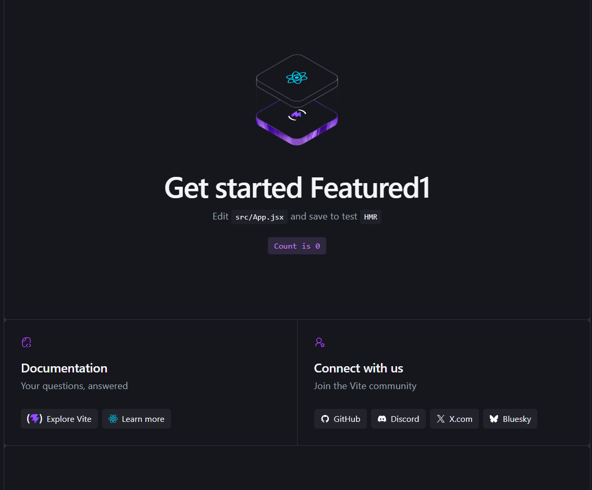

# NEXUS°

A modern, futuristic digital experience built with React and Vite.



## Overview

NEXUS° is a premium concept website focused on modern interfaces, digital products, and next-generation web experiences.

The project explores a clean dark aesthetic, bold typography, interactive elements, subtle motion, responsive layouts, and a polished visual experience.

## Features

- Modern premium UI
- Fully responsive layout
- Interactive hover effects
- Smooth animations and transitions
- Dark futuristic aesthetic
- Reusable React components
- Clean and maintainable code
- Optimized production build
- GitHub Pages deployment

## Tech Stack

- React
- Vite
- JavaScript
- CSS

## Getting Started

Clone the repository:

```bash
git clone https://github.com/a2rp/featured1.git
```

Move into the project directory:

```bash
cd featured1
```

Install dependencies:

```bash
npm install
```

Start the development server:

```bash
npm run dev
```

## Production Build

Create an optimized production build:

```bash
npm run build
```

Preview the production build locally:

```bash
npm run preview
```

## Live Demo

<a href="https://a2rp.github.io/featured1/" target="_blank" rel="noopener noreferrer">
  View NEXUS° Live
</a>

## Preview


## Project Structure

```text
featured1/
├── public/
├── src/
│   ├── assets/
│   ├── App.jsx
│   ├── App.css
│   ├── index.css
│   └── main.jsx
├── index.html
├── package.json
├── vite.config.js
├── preview.png
└── README.md
```

## Deployment

This project is configured for deployment on GitHub Pages.

The Vite base path is configured as:

```js
base: "/featured1/";
```

Build the project before deployment:

```bash
npm run build
```

## Author

**Ashish Ranjan**

Full-Stack Web Developer focused on building modern web experiences, frontend interfaces, backend systems, and experimental projects.

## Connect With Me

- [Portfolio](https://www.ashishranjan.net)
- [GitHub](https://github.com/a2rp)
- [CodePen](https://codepen.io/ash1198)
- [LinkedIn](https://www.linkedin.com/in/aashishranjan)
- [Facebook](https://www.facebook.com/theash.ashish/)
- [YouTube](https://www.youtube.com/@ashishranjan-ashz?sub_confirmation=1)
- [Buy Me A Coffee](https://buymeacoffee.com/a2rp)
- [Patreon](https://patreon.com/a2rp)
- [Email](mailto:ash.ranjan09@gmail.com)

## Support

If you like this project and want to support my work:

[Support My Work](https://a2rp-donation-page.netlify.app/)

## License

This project is licensed under the MIT License.

---

Made with ❤️ by [Ashish Ranjan](https://www.ashishranjan.net)
